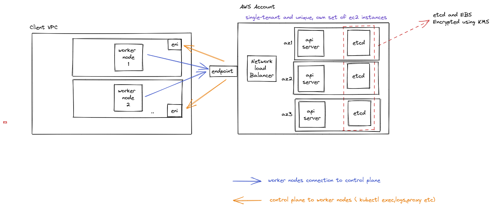

## EKS 

The most trusted way to start, run, and scale Kubernetes

 1 On cloud

1. Managed EKS cloud:
    - EC2
    - Fargate

3. Self Managed EKS distro 

2. On premises

2. Managed EKS Anywhere
   EKS on AWS OUTPOSTS
   Can add nodes running on AWS Local Zones , AWS Wavelength

## Features:
- Amazon EKS automatically manages the availability and scalability of the Kubernetes control plane nodes responsible for scheduling containers, managing application availability, storing cluster data, and other key tasks.

- EKS **supports AWS Fargate** to run your Kubernetes applications using serverless compute.
- Version support: 
    As new Kubernetes versions are released and validated for use with Amazon EKS, we **will support three stable Kubernetes versions** at any given time as part of the update process. Y

- You can use CloudTrail to view API calls to the Amazon EKS API. 
- Amazon EKS also delivers Kubernetes control plane logs to Amazon CloudWatch for analysis, debugging, and auditing.
- **EKS Connector**
    Amazon EKS allows you to connect any conformant Kubernetes cluster to AWS and visualize it in the Amazon EKS console. You can connect any conformant Kubernetes cluster, including Amazon EKS Anywhere clusters running on-premises, self-managed clusters on Amazon Elastic Compute Cloud (Amazon EC2), and other Kubernetes clusters running outside of AWS. 
- Amazon EKS is compliant with SOC, PCI, ISO, FedRAMP-Moderate, IRAP, C5, K-ISMS, ENS High, OSPAR, HITRUST CSF, and is a HIPAA eligible service.

## FAQS:

- Amazon EKS works by provisioning (starting) and managing the Kubernetes control plane and worker nodes for you. 
- At a high level, Kubernetes consists of two major components: 
    - a cluster of 'worker nodes' running your containers, and 
    - the control plane managing when and where containers are started on your cluster while monitoring their status.
- OS support: 
    - Amazon EKS supports Kubernetes-compatible Linux x86, ARM, and Windows Server operating system distributions. 
    - Amazon EKS provides optimized AMIs for Amazon Linux 2 and Windows Server 2019. 
    - EKS- optimized AMIs for other Linux distributions, such as Ubuntu, are available from their respective vendors 
- There are **two types of updates **you can apply to your Amazon EKS cluster: 
    - Kubernetes version updates and 
    - Amazon EKS platform version updates.
- Uptime:
    - Monthly Uptime Percentage of at least 99.95% during any monthly billing cycle (the "Service Commitment"). 
    - In the event Amazon EKS does not meet the Monthly Uptime Percentage commitment, you will be eligible to receive a Service Credit ( dollar credit)
    - uptime Less than 99.95% but greater than or equal to 99.0% - 10% service credit
    - uptime Less than 99.0% but greater than or equal to 95.0% - 25%  service credit
    - uptime Less than 95.0% -100%  service credit
## Pricing:

You pay **$0.10 per hour for each Amazon EKS cluster** that you create. You can use a single EKS cluster to run multiple applications by taking advantage of Kubernetes namespaces and IAM security policies. 

- If you are using Amazon EC2 (including with Amazon EKS managed node groups), you pay for AWS resources (e.g., EC2 instances or Amazon Elastic Block Store (EBS) volumes) you create to run your Kubernetes worker nodes. You only pay for what you use, as you use it; there are no minimum fees and no upfront commitments
- If you are using AWS Fargate, pricing is calculated based on the vCPU and memory resources used from the time you start to download your container image until the Amazon EKS pod terminates, rounded up to the nearest second. A minimum charge of one minute applies

## Control Plane

- The control plane **runs in an account managed by AWS**, 
- the Kubernetes API is exposed via the Amazon EKS endpoint associated with your cluster. 
- Each Amazon EKS cluster control plane is **single-tenant and unique**, and runs on its own set of Amazon EC2 instances.
- All of the data stored by the etcd nodes and associated Amazon EBS volumes is **encrypted using AWS KMS.**
- provisioned across multiple Availability Zones and 
- fronted by an Elastic Load Balancing Network Load Balancer
- provisions elastic network interfaces in your VPC subnets to provide connectivity from the control plane instances to the worker nodes in client VPC ((for example, to support kubectl exec , logs , and proxy data flows)
- Amazon EKS nodes run in your AWS account and connect to your cluster's control plane via the API server endpoint and a certificate file that is created for your cluster.

## Cluster creation

> Cluster provisioning takes several minutes (close to 10-15 minutes)

When an Amazon EKS cluster is created, the IAM entity (user or role) that creates the cluster is added to the Kubernetes RBAC authorization table as the administrator (with system:masters permissions). Initially, only that IAM user can make calls to the Kubernetes API server using kubectl. 

As a best practice, ensure that an IAM role is added to the aws-auth ConfigMap. This ensures that a cluster can be deleted after the creating user has been deleted. If you are in this situation and cannot delete a cluster, see this article to resolvebrazi.

## Cluster updation:

## Gotchas:
- Because Amazon EKS runs a highly available control plane, you c**an update only one minor version at a time.**
- The Kubernetes minor version of the managed and Fargate nodes in your cluster must be the same as the version of your control plane's current version before you update your control plane to a new Kubernetes version. For example, if your control plane is running version 1.20 and any of your nodes are running version 1.19, update your nodes to version 1.20 before updating your control plane's Kubernetes version to 1.21. 
- Even though Amazon EKS runs a highly available control plane, you might experience minor service interruptions during an update.

## Secret KMS Encryption

There is a secretsEncryption option that requires an existing AWS KMS key in AWS Key Management Service (AWS KMS). 

> If you create a cluster using a config file with the secretsEncryption option and the KMS key that you use is ever deleted, then there is no path to recovery for the cluster. 

The KMS key must be symmetric, created in the same Region as the cluster, and if the KMS key was created in a different account, the user must have access to the KMS key. 

======== extra

- Can pause and resume deployments

- EBS CSI (container storage interface)
    - create storage class
    - create pvc
    - volume mount