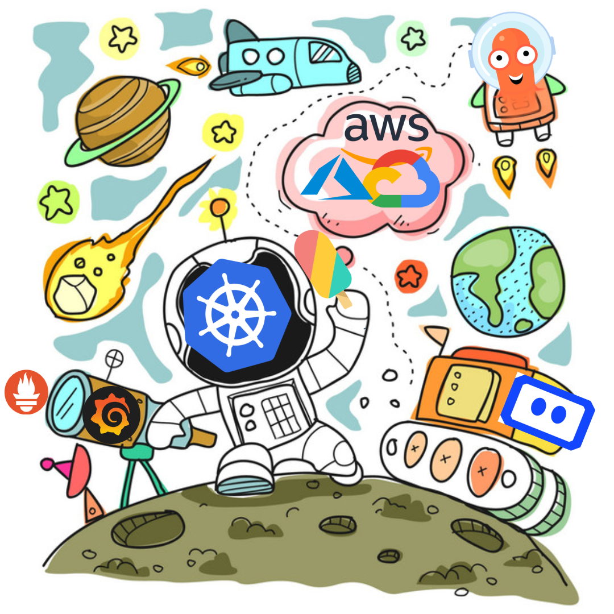

# Apollo11



**Apollo Airlines** — A cloud-native flight management system built across 13 stages, teaching you the full Kubernetes ecosystem from Docker Compose to custom operators.


---

## 🛫 The Application: Apollo Airlines

A flight reservation platform with 6 services and 4 infrastructure components:

| Service | Tech | Role |
|---|---|---|
| identity | Python/FastAPI | JWT auth, passenger profiles |
| flight | Go/Gin | Flight inventory, seat management |
| booking | Go/Gin | Reservations (flagship workflow) |
| search | Go/Gin | Flight search |
| notification | Go/Gin | Event fan-out |
| frontend | React (Tailwind CSS) | SPA |

**Infrastructure:** 3 PostgreSQL databases + 1 Redis

Launchpad also runs Dozzle as an optional log viewer. It is tooling around the
ten-component application, not an additional Apollo Airlines workload.

The **flagship workflow** — create a booking — spans 4 services and generates a distributed trace that students observe in observability tools:

```
Frontend → Booking Service → Identity Service
                        → Flight Service (get flight)
                        → Flight Service (decrement seats)
                        → Booking DB
                        → Notification Service
```

---

## Stages

### 🧱 Launchpad – Docker Compose ✅ [📖 README](stages/launchpad/README.md)

* ☑️ Learn what **Docker** is, why it exists, and how it solves the problem of environment consistency.
* ☑️ Understand containers conceptually and how they differ from virtual machines.
* ☑️ Write **Dockerfiles** and build container images using best practices and layering principles.
* ☑️ Use **Docker Compose** to run and wire together multiple containers locally.
* ☑️ Learn **YAML** syntax and structure as the foundation for Kubernetes configuration files.
* ☑️ Verify all services have `/healthz`, `/readyz`, `/metrics` endpoints
* ☑️ Modern React/Tailwind CSS frontend with environment-based API configuration

---

### 🔥 Ignition – First Kubernetes Cluster ✅ [📖 README](stages/ignition/README.md)

* ☑️ Launch a local Kubernetes cluster using **kind** and understand what components are created.
* ☑️ Use core **kubectl** commands to inspect, apply, modify, and delete Kubernetes resources.
* ☑️ Understand the difference between **imperative and declarative** resource management in Kubernetes.
* ☑️ Get a high-level overview of Kubernetes cluster architecture, with concepts that will be revisited in depth later.
* ☑️ **Launch your first Pod** and understand the structure and fields of a Pod manifest YAML.
* ☑️ Learn why Pods are fragile and why higher-level workload abstractions are required.

---

### Stage 1 : 🚀 Liftoff – All Workloads on Kubernetes ✅ [📖 README](stages/stage1/README.md)

* ✅ Organize all ten workloads in one **namespace**.
* ✅ Deploy applications with **Deployments** and observe their ReplicaSets and reconciliation behavior.
* ✅ Give Pods stable endpoints using **Services**.
* ✅ Run one-time database initialization using **Jobs** and mounted ConfigMaps.
* ✅ Externalize configuration using **ConfigMaps** and **Secrets**.
* ✅ Compare ephemeral `emptyDir` storage with the persistence added in Stage 3.

---

### Stage 2 : 🧭 Guidance, Navigation & Control – Networking ✅ [📖 README](stages/stage2/README.md)

* ✅ Resolve services through Kubernetes **DNS** and inspect cross-namespace routing.
* ✅ Compare ClusterIP, NodePort, and LoadBalancer **Services**.
* ✅ Route external traffic through Traefik **Ingress** and Envoy **Gateway API**.
* ✅ Assign local LoadBalancer addresses with **MetalLB**.
* ✅ Read reference **NetworkPolicies**; enforcement is deliberately deferred until a NetworkPolicy-capable CNI is introduced.

---

### Stage 3 : 💾 Mission Data – Persistent Storage ✅ [📖 README](stages/stage3/README.md)

* ✅ Replace `emptyDir` databases with **StatefulSets** and per-Pod PVCs.
* ✅ Inspect **PersistentVolumes**, claims, StorageClasses, and reclaim behavior.
* ✅ Use headless Services for stable StatefulSet network identity.
* ✅ Bootstrap PostgreSQL schemas through `/docker-entrypoint-initdb.d/` and seed data with idempotent Jobs.
* ✅ Delete a database Pod and prove that its data survives.

---

### Stage 4 : 🎛️ Flight Control Systems ✅ [📖 README](stages/stage4/README.md)

* ✅ Configure distinct **startup**, **liveness**, and **readiness probes**.
* ✅ Define equal CPU/memory requests and limits and observe **Guaranteed QoS**.
* ✅ Drain in-flight requests with graceful SIGTERM handling.
* ✅ Use **PodDisruptionBudgets** to constrain voluntary disruption.
* ✅ Delete workloads and observe termination, replacement, and recovery behavior.

---

### Stage 5 : 📦 Mission Payload Integration – Packaging ✅ [📖 README](stages/stage5/README.md)

* ✅ Package and template the verified platform using **Helm**.
* ✅ Compare Helm with committed **Kustomize** overlays for dev, staging, and prod.
* ✅ Validate and publish images through **GitHub Actions** CI.
* ✅ Reconcile isolated environments through an optional **Argo CD** GitOps module.

---

### Stage 6 : 📡 Mission Operations – Observability ✅ [📖 README](stages/stage6/README.md)

* ✅ Collect and query metrics using **Prometheus**.
* ✅ Visualize metrics and build dashboards using **Grafana**.
* ✅ Centralize logs using **Loki** and correlate them with metrics.
* ✅ Trace requests across services using **OpenTelemetry**.
* ✅ Debug using distributed traces.
* ✅ Use **DaemonSets** to deploy monitoring and system agents on every node.

---

### Stage 7 : 🛰️ Orbital Maneuvering – Scaling ✅ [📖 README](stages/stage7/README.md)

* ✅ Configure a CPU-based **Horizontal Pod Autoscaler (HPA)** and inspect its live metrics and decisions.
* ✅ Generate recommendation-only resource guidance using **Vertical Pod Autoscaler (VPA)**.
* ✅ Add Redis cache-aside behavior with observable HIT/MISS responses.
* ✅ Run a reversible scheduling lab using **PriorityClasses**, a worker taint,
  toleration, node affinity, and topology spread.
    
---

### Stage 8 : 🔐 Command Module Hardening – Security ⚠️ Planned [📖 status](stages/stage8/README.md)

* ☐ Implement fine-grained access control using **Role-Based Access Control (RBAC)**.
* ☐ Secure Pods using **SecurityContext** (runAsNonRoot, readOnlyRootFilesystem).
* ☐ Use **hardened container images** to minimize the attack surface.
* ☐ Authenticate workloads using **Service Accounts**.
* ☐ Store and manage secrets securely using **Vault** as an external key store.
* ☐ Enforce baseline security standards using **OPA Gatekeeper** or **Kyverno**.
* ☐ Scan container images using **Trivy**.

---

### Stage 9 : 🌕 Lunar Orbit – Cloud Deployment ⚠️ Planned [📖 status](stages/stage9/README.md)

* ☐ Provision one primary cloud lifecycle with **Terraform**, then compare a second provider as a portability mission.
* ☐ Scale cluster nodes dynamically using **Cluster Autoscaler**.
* ☐ Load test applications using **k6** to validate performance.
* ☐ Distribute workloads evenly using **topology spread constraints**.
* ☐ **Perform safe Kubernetes cluster upgrades**.
* ☐ Protect availability during disruptions using **Pod Disruption Budgets**.
* ☐ Prove **high availability** through controlled node-failure and recovery drills.

---

### Stage 10 : 🧪 Mission Extensions ⚠️ Planned [📖 status](stages/stage10/README.md)

* ☐ Hook into Pod and container lifecycle events using **lifecycle hooks**.
* ☐ Implement a **service mesh** using **Linkerd** for traffic management and security.
* ☐ Perform **progressive deployments** using **Argo Rollouts**.
* ☐ Use **Kubeshark** to analyze packets and service traffic.
* ☐ Debug running Pods using **ephemeral containers** without restarting workloads.
* ☐ Build a full **DevSecOps pipeline** integrating security into delivery.
* ☐ Implement backup and restore strategies using **Velero**.
* ☐ Introduce controlled failures using **Chaos Mesh** to test resilience.

---

### Stage 11 : 🚀 Towards Mars ⚠️ Planned [📖 status](stages/stage11/README.md)

* ☐ Design and implement custom **CRDs** and **Kubernetes operators**.
* ☐ Extend the Kubernetes API server with custom functionality.
* ☐ Build a **homelab using k3s** and expose services securely.
* ☐ Implement event-driven autoscaling using **KEDA**.
* ☐ Build internal developer platforms using **Backstage**.
* ☐ Analyze and optimize cluster costs using **Kubecost**.
* ☐ Manage clusters declaratively using **Cluster API**.

---

## How to use the labs

Completed stages provide automation because the platform is large and every
snapshot must remain reproducible. Treat `apply.sh` and `verify.sh` as the
installer and answer key. The learning happens in each README's manual
inspection and failure exercises: observe the new behavior, break it safely,
recover it, and only then run the full verifier.

Pass counts show that the repository is internally consistent; they do not
replace being able to explain what Kubernetes did and which evidence proved it.

---

## Prerequisites

- Basic knowledge of Linux (command line, file system, environment variables)
- Docker installed and running (`docker --version`)
- No prior Kubernetes experience required

---

## Getting Started

### 1. Install Devbox

```bash
curl -fsSL https://get.jetify.com/devbox | bash
```

### 2. Set Up Environment

```bash
devbox shell  # loads all tools defined in devbox.json
```

### 3. Tools Installed

| Tool | Purpose |
|---|---|
| docker | Container runtime |
| kubectl | Kubernetes CLI |
| kind | Local k8s clusters |
| k3d | Alternative local k8s |
| helm | Chart packaging |
| kustomize | Config patching |
| skaffold | Local dev pipelines |
| k9s | Terminal dashboard |
| terraform | Cloud provisioning |
| argocd | GitOps deployment |
| k6 | Load testing |
| trivy | Image scanning |
| opa | Policy engine |

### 4. Start with Launchpad

```bash
cd stages/launchpad
docker compose up
```

---

## Project Structure

```
Apollo11/
├── SPEC.md                   # Full API contracts, service schemas, endpoints
├── README.md                 # This file
├── AGENTS.md                 # Agent context for AI assistants
│
├── stages/
│   ├── launchpad/            # Docker Compose — 10 components, stub code
│   │   ├── README.md
│   │   ├── docker-compose.yml
│   │   └── code/             # identity, flight, booking, search, notification, frontend
│   │
│   ├── ignition/             # kind cluster, first Pod, kubectl basics
│   │   └── README.md
│   │
│   ├── stage1/               # K8s: Deployments, ConfigMaps, Secrets, Jobs
│   │   ├── README.md
│   │   ├── k8s/
│   │   ├── scripts/
│   │   └── code/
│   │
│   ├── stage2–stage11/       # (scope defined in SPEC.md)
│   │
└── test/                     # Automated verification scripts per stage
```

Each stage is independently runnable. Each stage's `code/` directory is a self-contained snapshot that copies the previous stage's code and adds its additions.

---

## Code Evolution

| Stage | What Changes |
|---|---|
| Launchpad | Stub code with `/healthz`, `/readyz`, `/metrics`, structured logging. Frontend: React/Tailwind CSS with VITE env vars for API URLs. |
| Stage 1–3 | k8s manifest evolution only, code unchanged |
| Stage 4 | Add `/healthz/startup`, `/healthz/live`, `/healthz/ready` handlers + SIGTERM graceful shutdown. Frontend remains the React/Tailwind snapshot served by NGINX. |
| Stage 5 | Packaging only, code unchanged |
| Stage 6 | Full `/metrics` + OTEL SDK integrated |
| Stage 7 | Search gets Redis caching (X-Cache header) |
| Stage 8 | **Planned:** rebuild from Stage 7 with observable RBAC, workload-hardening, network-policy, secrets, admission-policy, and image-scanning exercises |
| Stage 9 | **Planned:** one primary cloud lifecycle with scaling, node failure, upgrade, cost, and teardown drills |
| Stage 10 | **Planned optional missions:** service mesh, progressive delivery, debugging, backup/restore, chaos |
| Stage 11 | **Planned optional specializations:** operator/CRD, KEDA, k3s, Backstage, Kubecost, Cluster API |

---

## Seed Data (Always Present)

**Airports:** BOM, DEL, SIN, DXB, LHR, JFK

**Flights (today + 30 days):** AA101, AA102, AA201, AA202, AA301, AA401

**Users:**
- `admin@apolloairlines.com` / `admin123` (ADMIN)
- `passenger@apolloairlines.com` / `pass123` (PASSENGER)

---

## Tools

| Category | Tools |
|---|---|
| Frontend | React, Tailwind CSS, Vite |
| Backend API | Golang, Python |
| SQL Database | PostgreSQL |
| NoSQL Database | Redis |
| CI | GitHub Actions |
| GitOps | ArgoCD |
| Progressive Deployment | Argo Rollouts |
| Secret Store | Vault |
| Ingress Controller | Traefik |
| Packaging | Helm |
| Patching | Kustomize |
| Logging | Grafana Alloy, Loki |
| Service Mesh | Linkerd |
| Monitoring | Prometheus, Grafana |
| Policy Engine | OPA |
| Backup and Restore | Velero |
| Load Testing | k6 |
| Cluster Provisioning | Terraform |
| Chaos Engineering | Chaos Mesh |
| Autoscaling | HPA, VPA, KEDA |
| Custom Controllers | Kubernetes Operators |
