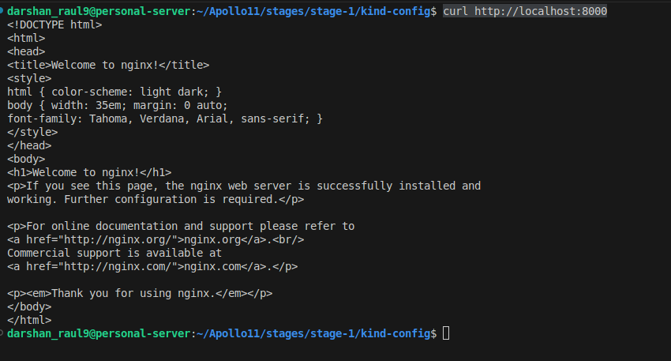

# Running the apps in local k8s

Now that we have all our code working with Docker Compose, it’s time to run it on our local Kubernetes (k8s) cluster. There are multiple options for this:

- **[Minikube](https://minikube.sigs.k8s.io/docs/start)**

    The most famous of the lot. A tool that lets you run Kubernetes locally by spinning up a single-node cluster inside a VM on your machine.
    
    Features:

    - Supports multiple VM drivers and container runtimes.
    - Easy setup with built-in add-ons.
    - Native Kubernetes environment with full API support.

- **[Kind](https://kind.sigs.k8s.io/docs/user/quick-start#creating-a-cluster)** (Kubernetes in Docker)

    A tool for running Kubernetes clusters in Docker containers [and now podman and containerd], ideal for CI pipelines and testing.
    
    Features:

    - Runs Kubernetes entirely in Docker.
    - Supports multi-node clusters.
    - Lightweight and fast to set up.

- **[MicroK8s](https://microk8s.io)**

    A lightweight, pure upstream Kubernetes distribution for workstations, IoT, and appliances.
    
    Features:

    - Zero-configuration installation.
    - Efficient resource usage for edge computing.
    - Full Kubernetes experience with add-on services.
        -Prometheus, Jaeger, Istio, LinkerD and KNative and many more are available are readymade addons

- **[k3s](https://k3s.io)**

    A lightweight Kubernetes distribution designed for resource-constrained environments and edge computing.
    
    Features:

    - Reduced resource footprint with lightweight binaries.
    - Built-in support for external databases.
    - Easy upgrades and support for both ARM and x86 platforms.

- **[Rancher Desktop](https://k0sproject.io)**

    An open-source Kubernetes tool that provides container management on your desktop with a GUI.
    
    Features:

    - Seamless integration with Docker CLI.
    - Switch between container runtimes (e.g., containerd, dockerd).
    - Built-in Kubernetes dashboard for easy cluster management.

- **[k0s](https://k0sproject.io)**

    A zero-friction, fully conformant Kubernetes distribution built for simplicity and minimal overhead.
    
    Features:

    - Single binary with a minimal footprint.
    - No dependencies on external databases or systems.
    - Integrated high availability and multi-node setup support.


I have decided to use kind for this course but it can be followed with absolutely any of these local distributions. Each of them have their tradeoffs and ultimately its our preference.

## Creating kind cluster

### Install kind binary

Follow this link to know more: https://kind.sigs.k8s.io/docs/user/quick-start#installing-from-release-binaries

- For linux, follow these steps:

    ```
    # For AMD64 / x86_64
    [ $(uname -m) = x86_64 ] && curl -Lo ./kind https://kind.sigs.k8s.io/dl/v0.24.0/kind-linux-amd64
    # For ARM64 [use this if not using amd computes, mac,gravtion servers etc]
    # [ $(uname -m) = aarch64 ] && curl -Lo ./kind https://kind.sigs.k8s.io/dl/v0.24.0/kind-linux-arm64
    chmod +x ./kind
    sudo mv ./kind /usr/local/bin/kind
    ```

- Change directory to kind directory in the stage 1 folder
    - `cd stages/stage-1/kind-config`
- Look at the content of the kind config file. It is being used to create a kind cluster with custom settings (more that one node in this case) 
    - `cat kind-config.yaml`
- You can read more about customizing kind configuration here: https://kind.sigs.k8s.io/docs/user/configuration/


### Create kind cluster with name and 3 workers

> Optional: The reason I have gone with 3 workers is to get a feel of a real cluster 

Lets create the kind cluster

- `cd stages/stage-1/kind-config`
- `kind create cluster --name apollo --config kind-config.yaml`


Next run this command to cehck if cluster is running correctly:  
- `kubectl cluster-info --context kind-apollo`


- Confirm the nodes are correct `kubectl get nodes`


- Can look at `cat ~/.kube/config` to confirm that cluster config is set correctly

### Creating a test pod

- Lets try the default hello world of any k8s cluster, running the nginx image
- `kubectl run nginx --image=nginx`
- You should be seeing a `pod/nginx created` output
- Confirm our pod has been created: `kubectl get pods`


run `kubectl port-forward pod/nginx 8000:80` in one terminal 

This will make sure that the port 80 in the nginx pod will be exposed as port 8000 on your localhost


Open a different terminal and try accessing the site:
`curl http://localhost:8000`



Delete the pod using `kubectl delete pod/nginx`

## Creating namespace

- `cd /stages/stage-1/manifests/namespace`
- `kubectl apply -f namespace.yaml`


- `kubectl get namespaces`


- To get more info on namespaces refer: [namespaces](https://darshan-raul.gitbook.io/cloudnativeguide/kubernetes/concepts/namespaces)

### Putting resource quotas

## Load all the images inside kind cluster

`kind load docker-image apollo11-payment:latest --name apollo`
`kind load docker-image apollo11-movie:latest --name apollo`
`kind load docker-image apollo11-booking:latest --name apollo`
`kind load docker-image apollo11-theatre:latest --name apollo`
`kind load docker-image apollo11-dashboard:latest --name apollo`

> Note: because this will be local images, we need to ensure that we keep imagepullpolicy=never when running in the local cluster to avoid any image pull business

## Creating payment service


## Best practices when creating a deployment

### Using specific image tags instead of latest

### Adding resource limits


```
resources:  # Limit the container's resource usage
    requests:
        memory: "64Mi"
        cpu: "250m"
    limits:
        memory: "128Mi"
        cpu: "500m"
```

### Putting Liveness,startup and readiness probe

```
readinessProbe:  # Add readinessProbe to detect when the container is ready to receive traffic
    httpGet:
        path: /healthz  # Adjust the path to your app's health check
        port: 8080
    initialDelaySeconds: 5
    periodSeconds: 10
    livenessProbe:  # Add livenessProbe to ensure the container is healthy
    httpGet:
        path: /healthz
        port: 8080
    initialDelaySeconds: 15
    periodSeconds: 20
```


## Tools

### K9s
### Kubens
### Kubectx
### jsonpath parsing

## Extra

### Kompose

- There is a tool called Kompose which can be used to convert your docker compose files into k8s manifests
- Infact I used it to initially convert the docker compose file to the initial set of manifests
- Refer the docs at https://kompose.io to know more

> Note: in my observations, you will have to tweak quite a bit to make the manifests work if you have some complex usecases but for simpler applications this will work like a charm

- Just install kompose by following their guide and run `kompose convert` and you get your k8s manifests! Give it a try

## Useful kubectl commands

- `kubectl explain <resourcename>`
- `kubectl explain <resourcename> --recursive`
- `kubectl <syntax> --dry-run=client -o yaml`
